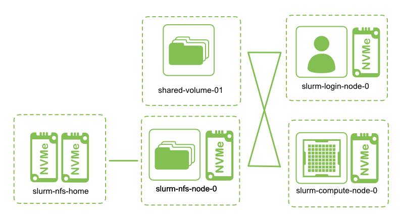

# SLURM
This repository is the simplest way to create a high-availability
[SLURM](https://slurm.schedmd.com/quickstart.html) cluster on Crusoe Cloud.
To get started, create a file named `terraform.tfvars` with the cluster
parameters. For example `.tfvars` files, see the `examples` directory.
```
terraform init
terraform apply
```

## What is provided by the cluster?


By default, this solution will create a high-availability SLURM cluster with:
* 2 `c1a.16x` head nodes
* 2 `c1a.16x` login nodes
* 1 `s1a.80x` nfs node
* n compute nodes of any instance type.

## Storage


This solution currently supports three tiers of storage:

### Local Scratch
Each `slurm-compute-node` instance supports up to `7.5 TiB` of local scratch
storage, depending on the instance type. If present, scratch storage is located
at `/scratch/local`.  The local scratch storage is erased whenever the compute
node is stopped.

The local scratch size on common compute node instance types are:
* `a40.8x`: 7.5 TiB
* `100.8x`: 7.5 TiB
* `a100-80gb.8x`: 7.5 TiB
* `a100-80gb-sxm-ib.8x`: 7.5 TiB
* `h100-80gb-sxm-ib.8x`: 7.5 TiB
* `l40s-48gb.8x`: None
* `c1a.176x`: None

### Shared Scratch
Each cluster supports up to `51.2 TiB` of shared scratch storage, depending on
the instance type of `slurm-nfs-node-0`. This scratch storage is located at
`/scratch/shared`. The shared scratch storage is erased whenever
`slurm-nfs-node-0` is stopped.

The `slurm_nfs_node_type` variable can optionally be set in the `terraform.tfvars` file
to configure the instance type used to create `slurm-nfs-node-0`. If left unconfigured,
this will default to `s1a.80x`.

The remote scratch size on common nfs node instance types are:
* `s1a.80x`: 51.2 TiB
* `s1a.40x`: 25.6 TiB
* `c1a.176x`: None

### Shared
The `slurm-nfs-node-0` node exports a persistent `/home` directory that is mounted by
all login nodes and all compute nodes. This offers up to `10 TiB` of persistent shared
storage.

The `slurm_nfs_home_size` variable can optionally be set in the `terraform.tfvars` file
to configure the size of the `/home` nfs share. If left unconfigured, this will default
to 10 TiB. Note that `10 TiB` is the maximum currently supported by Crusoe Cloud.

## User Management
To add additional users to your cluster, configure the `slurm_users` variable in your
`terraform.tfvars` file and run `terraform apply`. The following example adds three
additional users `user1`, `user2`, and `user3` to the slurm cluster.
```
# slurm users configuration
slurm_users = [{
  name = "user1"
  uid = 1001
  ssh_pubkey = "ssh-ed25519 AAAAC3NzaC1lZDI1NTE5AAAAIIjPRr0iVR4mgzJy0ehnM5hWX4O86hM1bVTgdi5g3nkZ user1@crusoe.ai"
}, {
  name = "user2"
  uid = 1002
  ssh_pubkey = "ssh-ed25519 AAAAC3NzaC1lZDI1NTE5AAAAIIjPRr0iVR4mgzJy0ehnM5hWX4O86hM1bVTgdi5g3nkZ user2@crusoe.ai"
}, {
  name = "user3"
  uid = 1003
  ssh_pubkey = "ssh-ed25519 AAAAC3NzaC1lZDI1NTE5AAAAIIjPRr0iVR4mgzJy0ehnM5hWX4O86hM1bVTgdi5g3nkZ user3@crusoe.ai"
}]
```

## Enroot and Pyxis
This solution provides support for [NVIDIA Enroot](https://github.com/nvidia/enroot)
and [Pyxis](https://github.com/NVIDIA/pyxis).
```
srun --container-image=<image> <cmd>
```

## MPI ( Experimental )
This solution includes PMIx support for running Open MPI applications.
```
srun --mpi=pmix <cmd>
```

Note that it may be necessary to rebuild HPCx to link against the same version of PMIx that
SLURM was build with.
```
./hpcx_rebuild.sh --ompi-extra-config "--with-pmix=/opt/pmix --with-hwloc=/usr --with-libevent=/usr"
```

Once hpcx is rebuilt with PMIx support, the correct version of HPCx must be loaded before running
MPI jobs.
```
source /opt/hpcx/hpcx_rebuild.sh
hpcx_load
```

## How do I handle a head node outage?
This solution utilizes a secondary head-node that will take over within 10
seconds if the primary head-node stops responding. As long as at least one
head-node is still responsive, the cluster will remain usable.

## How do I handle a nfs node outage?
Note that NFS is not deployed in a high-availability configuration.
If `slurm-nfs-node-0` goes down, then none of the login nodes or compute
nodes will be able to mount the `/home` directory. This will prevent users
from logging in to any `slurm-login-node` or `slurm-compute-node`. The cluster
will recover gracefully once `slurm-nfs-node-0` is brought back online. 
During this time, it is still possible to login to any of the nodes as
the `root` user.

## How do I handle a login node outage?
If one of the login nodes goes offline, the other login nodes will remain
fully functional. As long as cluster users store data in their home directory,
which is backed by a nfs share, they should be able to ssh into another login
node and continue using the cluster.

## How do I handle a compute node outage?
When a compute node is rebooted or stops responding for more than 5 minutes,
it will be marked as `DOWN`.

```bash
sinfo
PARTITION AVAIL  TIMELIMIT  NODES  STATE NODELIST
batch*       up   infinite      1  down* slurm-compute-node-0
batch*       up   infinite      7   idle slurm-compute-node-[1-7]
```

Once the compute node is back online, the following command can be used to return
it to the cluster.
```bash
sudo scontrol update NodeName=slurm-compute-node-0 State=RESUME
```

Once the compute node has been returned to the cluster, it should enter an `IDLE` state.
```bash
sinfo
PARTITION AVAIL  TIMELIMIT  NODES  STATE NODELIST
batch*       up   infinite      8   idle slurm-compute-node-[0-7]
```
