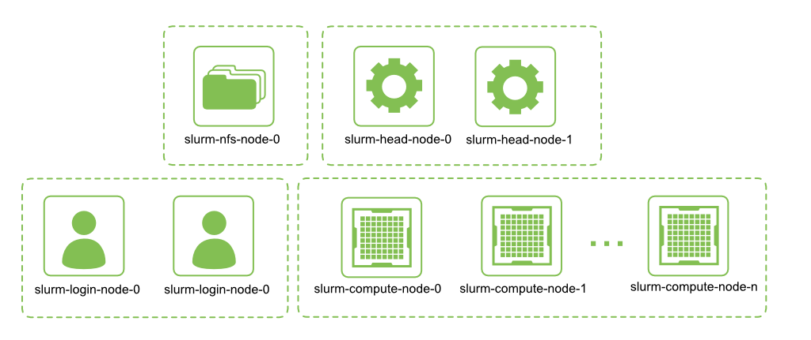

# SLURM
This repository is the simplest way to create a high-availability SLURM cluster on
Crusoe Cloud. To get started, create a file named `terraform.tfvars` with the cluster
parameters. For example `.tfvars` files, see the `examples` directory.
```
terraform init
terraform apply
```

## What is provided by the cluster?


By default, this solution will create a high-availability SLURM cluster with:
* 2 `c1a.16x` head nodes
* 2 `c1a.16x` login nodes
* 1 `s1a.80x` nfs node
* n compute nodes of any instance type.

The `slurm-nfs-node-0` exports a `/home` directory backed by a 10 TiB persistent
SSD. The `/home` nfs directory is mounted by all login nodes and all compute nodes. This
solution provides support for [NVIDIA Pyxis](https://github.com/NVIDIA/pyxis) 
and [Enroot](https://github.com/nvidia/enroot).

## How do I handle a head node outage?
This solution utilizes a secondary head-node that will take over within 10
seconds if the primary head-node stops responding. As long as at least one
head-node is still responsive, the cluster will remain usable.

## How do I handle a nfs node outage?
Note that NFS is not deployed in a high-availability configuration.
If `slurm-nfs-node-0` goes down, then none of the login nodes or compute
nodes will be able to mount the `/home` directory. This will prevent users
from logging in to any `slurm-login-node` or `slurm-compute-node`. The cluster
will recover gracefully once `slurm-nfs-node-0` is brought back online. 
During this time, it is still possible to login to any of the nodes as
the `root` user.

## How do I handle a login node outage?
If one of the login nodes goes offline, the other login nodes will remain
fully functional. As long as cluster users store data in their home directory,
which is backed by a nfs share, they should be able to ssh into another login
node and continue using the cluster.

## How do I handle a compute node outage?
When a compute node is rebooted or stops responding for more than 5 minutes,
it will be marked as `DOWN`.

```bash
sinfo
PARTITION AVAIL  TIMELIMIT  NODES  STATE NODELIST
batch*       up   infinite      1  down* slurm-compute-node-0
batch*       up   infinite      7   idle slurm-compute-node-[1-7]
```

Once the compute node is back online, the following command can be used to return
it to the cluster.
```bash
sudo scontrol update NodeName=slurm-compute-node-0 State=RESUME
```

Once the compute node has been returned to the cluster, it should enter an `IDLE` state.
```bash
sinfo
PARTITION AVAIL  TIMELIMIT  NODES  STATE NODELIST
batch*       up   infinite      8   idle slurm-compute-node-[0-7]
```
